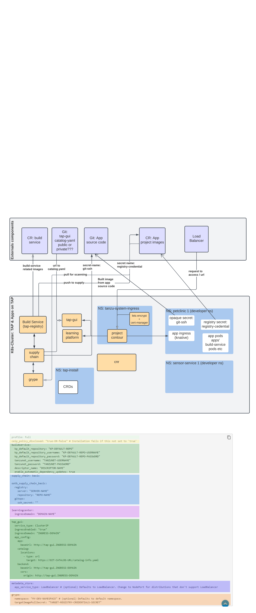

# Merlin's tapwizard


A wizard like UI (GUI coming soon) for Tanzu Application Platform. The goal is to:
- Provide a installer experience to get TAP deployed on the k8s cluster
- provide a wizard experience to create TAP profile to support the architecture described here: https://github.com/vmware-tanzu-labs/tanzu-validated-solutions/blob/main/src/reference-designs/tap-architecture-planning.md
- Quick, Easy and Fast way to demo TAP 
- Quick, Easy and Fast way to start using TAP

** few things are WIP .. will be updated soon

## pre-req
- docker ce or ee installed locally
- download tanu cli (https://network.pivotal.io/products/tanzu-application-platform/#/releases/1043418), and place the tar in binaries directory
- download cluster essential for vmware tanzu (https://network.pivotal.io/products/tanzu-cluster-essentials#/releases/1011100) and place the tgz in binaries directory.
- download tap gui (https://network.pivotal.io/products/tanzu-application-platform/#/releases/1043418/file_groups/6091) 
    - untar the tar.gz
    - create a git public repository and clone it
    - add the untar-ed/inflated contents to the git and push the untar (eg: blank or yelp) 
    - grab the url of catalog-info.yaml (eg: https://github.com/alinahid477/tap-gui/blob/main/blank/catalog-info.yaml) and keep it handy.
- k8 cluster (aks, eks). [TKGs --- coming soon].
    - create a k8s cluster (**This wizard can also create aks k8s cluster**)
        - if you have created k8s cluster outside of this wizard grab the kubeconfig file and place it in the .kube directory
        - if you do not have a k8s cluster handy the wizard will detect and prompt for creating a cluster (post cluster create it will add the kubeconfig file in .kube directory)
            - **creating aks cluster**: ceate service principal app with necessary permissions and keep the app id, tenantid and app secret handy.
- you own container registry details (see below env variable)
- .env file (see below)

## .env
Run `cp .env.sample .env`

fill out the necessary details (ignore the vsphere related variables for now)

- PVT_REGISTRY_SERVER=eg: my-harbor.io or index.docker.io/v1 or myregistry.azurecr.io
- PVT_REGISTRY_REPO=eg: registryname like petclinic or supplychain
- PVT_REGISTRY_USERNAME=eg: your username
- PVT_REGISTRY_PASSWORD=eg: your password
- TANZU_CLI_NO_INIT=true (do not change)
- INSTALL_BUNDLE=registry.tanzu.vmware.com/tanzu-cluster-essentials/cluster-essentials-bundle@sha256:82dfaf70656b54dcba0d4def85ccae1578ff27054e7533d08320244af7fb0343 (do not change)
- INSTALL_REGISTRY_HOSTNAME=registry.tanzu.vmware.com (do not change)
- INSTALL_REGISTRY_USERNAME=eg: your tanzu net username
- INSTALL_REGISTRY_PASSWORD=eg: your tanzu net password
- TAP_VERSION=1.0.1 (do not change)
- DESCRIPTOR_NAME=tap-1.0.0 (do not change)


## Start

### for linux or mac
```
chmod +x start.sh
./start.sh
```

### for windows
```
start.bat
```

# That's it
follow the prompt of the UI for a guided experience of installing TAP on k8s


# Some concept dump (WIP)

## Road Map
- EKS cluster create
- Service principal create 
- TKG installation
- built in templates for TAP in different k8s environment (eg: workspace cluster, build cluster, run cluster, UI cluster)

## TAP components

