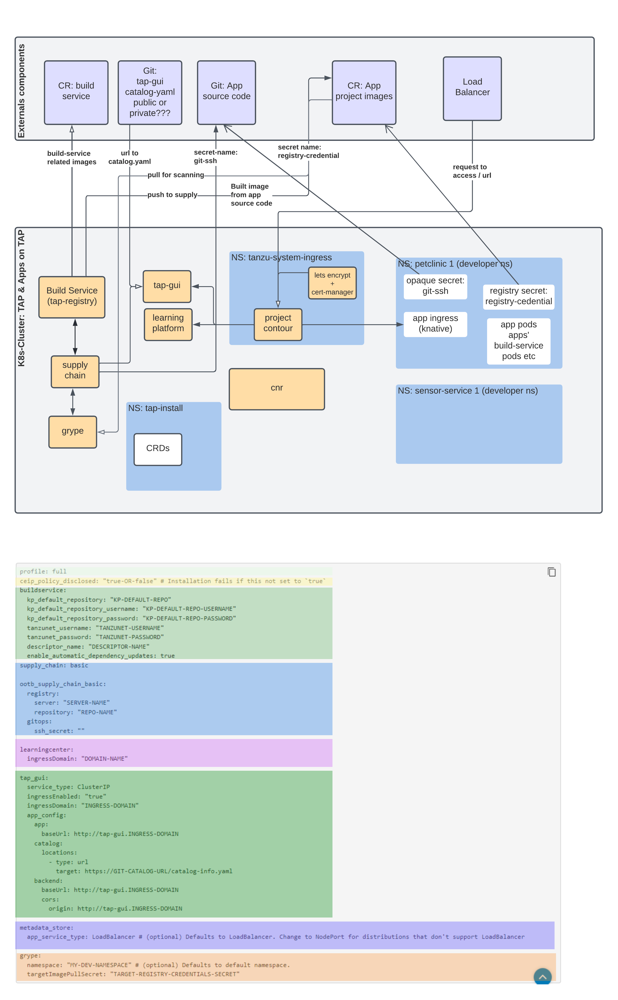

# Merlin's tapwizard


A wizard like UI (GUI coming soon) for Tanzu Application Platform. The goal is to:
- Provide an installer experience to get TAP deployed on the k8s cluster
- provide a wizard experience to create TAP profile to support the architecture described here: https://github.com/vmware-tanzu-labs/tanzu-validated-solutions/blob/main/src/reference-designs/tap-architecture-planning.md
- Quick, Easy and Fast way to install TAP 
- Quick, Easy and Fast way to start using TAP

## pre-req
- docker ce or ee installed locally
- account in tanzunet (https://login.run.pivotal.io/login). If you dont have an account create one (it's free).
- download `tanu framework` (https://network.pivotal.io/products/tanzu-application-platform/), and place the tar in `binaries` directory
- download `cluster essential for vmware tanzu` (https://network.pivotal.io/products/tanzu-cluster-essentials) and place the tgz in `binaries` directory.
- download `tap gui` (https://network.pivotal.io/products/tanzu-application-platform/#/releases/1095326/file_groups/6091) 
    - untar the tar.gz
    - create a git public repository and clone it
    - add the untar-ed/inflated contents to the git repo and push the untar (eg: blank or yelp) 
    - grab the url of catalog-info.yaml (eg: https://github.com/alinahid477/tap-gui/blob/main/blank/catalog-info.yaml) and keep it handy.
- kubeconfig file of a k8 cluster (aks, eks, tkg).
    - **If k8s cluster is not pre-existing** create a new k8s cluster (**This wizard can create aks k8s cluster**)
        - if there's no kubeconfig detected the wizard will prompt for creating a new cluster (post cluster create it will add the kubeconfig file in `.kube` directory)
        - **creating aks cluster**: requires a service principle. If you do not have a service principal follow the wizard prompt to create a new one.
    - **if there's already a k8s cluster** get the kubeconfig file for the cluser and place it in the `.kube` directory with name `config`
        - this wizard will detect the available contexts and prompt for selecting the the right one.
        - ***If the kubernetes control plane is private and requires accessing through bastion host*** please replace the control plane url/ip of `clusters.cluster.server` field with `kubernetes`. eg> `server: https://kubernetes:6443` in `kubeconfig` file placed in `.kube` directory of this dir. You may also be required to replace the value of `users.user.exec.env.name=CLUSTER_ENDPOINT` from private url/ip to `kubernetes`, eg> `value: https://kubernetes:6443`

- Container registry details (see below env variable)
- .env file (see below)

## .env
Run `cp .env.sample .env`

fill out the necessary details (ignore the vsphere related variables for now)

- PVT_REGISTRY_SERVER=eg: my-harbor.io or index.docker.io/v1 or myregistry.azurecr.io
- PVT_REGISTRY_REPO=eg: registryname like petclinic or supplychain
- PVT_REGISTRY_USERNAME=eg: your username
- PVT_REGISTRY_PASSWORD=eg: your password
- TANZU_CLI_NO_INIT=true (do not change)
- INSTALL_BUNDLE=registry.tanzu.vmware.com/tanzu-cluster-essentials/cluster-essentials-bundle@sha256:ab0a3539da241a6ea59c75c0743e9058511d7c56312ea3906178ec0f3491f51d (change as per value here: https://docs.vmware.com/en/Cluster-Essentials-for-VMware-Tanzu/1.1/cluster-essentials/GUID-deploy.html)
- INSTALL_REGISTRY_HOSTNAME=registry.tanzu.vmware.com (do not change)
- INSTALL_REGISTRY_USERNAME=eg: your tanzu net username
- INSTALL_REGISTRY_PASSWORD=eg: your tanzu net password
- TAP_VERSION=1.1.1 (change as per tap version: https://network.pivotal.io/products/tanzu-application-platform/)
- DESCRIPTOR_NAME=tap-1.1 (do not change)


## Start

### for linux or mac
```
chmod +x start.sh
./start.sh
```

### for windows
```
start.bat
```

# That's it
follow the prompt of the UI for a guided experience of installing TAP on k8s

## Demo Video:

[](https://youtu.be/vHhRGqbM3uU)


# TODO
- GUI for installer
- GUI for supply chain (in progress)


# Flux CD Stuff

- exclude `fluxcd.source.controller.tanzu.vmware.com` from RUN cluster profile
- Manually install fluxcd (as described below)
    - This is because with `source-control.flux.io` (which is what TAP installs) only does source code fetch
    - We also need to "kubectl apply -f config/delivery.yaml" (delivery.yaml generated and pushed by build cluster -- supply-chain / tekton gitops)
    - installing fluxcd the below way will also install `Kustomize.flux.io` which will do kubectl apply based on the source 

https://fluxcd.io/docs/installation/

```
curl -s https://fluxcd.io/install.sh | sudo bash
flux check --pre
export GITHUB_TOKEN=<your-token>
flux bootstrap github --owner=alinahid477 --repository=pvtrepo --path=flux-system --personal=true --private=true
## Modify the binaries/templates/fluxcd-run.yaml file accordingly and run the below
kubectl deploy -f binaries/templates/fluxcd-run.yaml
```


# Some concept dump (WIP)

## Road Map
- EKS cluster create
- Service principal create 
- TKG installation
- built in templates for TAP in different k8s environment (eg: workspace cluster, build cluster, run cluster, UI cluster)

## TAP components

